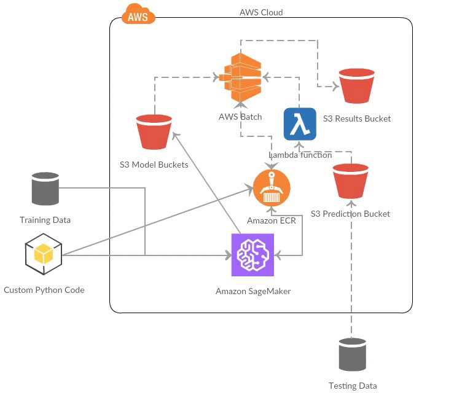

# Text Classification with Gluon on Amazon SageMaker and AWS Batch
by Matt Krzus and Jason Berkowitz | on 30 MAR 2018 | in Apache MXNet On AWS, SageMaker

Our customer had a problem: The manual classification of warranty claims was causing a bottleneck. These claims were based on a text field that explained the event in short detail. An example of that text looked something like this: “The plutonium-fueled nuclear reactor overheated on a hot day in Arizona’s recent inclement weather. Burn damage to the flux capacitor. It will not time travel without replacing.” The classification of the claim might be something like “fire.”

A worker in the claims department had to read a batch of warranty claims, usually in the thousands, and manually classify each example with the proper warranty category to make sure that the submitter classified the claim correctly.

The company wanted to speed up the pipeline to minimize the time it took them to resolve the claims. This was central to keeping their customers satisfied. Because the company has such a large and extensive database of past warranty claims, turning toward a supervised learning solution was a logical next step.

This blog post outlines a solution for the classification of the sentiment of a given text that helped accelerate our customer’s workflow by bridging the gap between the non-technical claims team and the more solutions-focused data science team. For this example scenario, we will train our classification model using MXNet’s Gluon and Amazon SageMaker, then build an application based on AWS Lambda to process large batches of text using elastic resources on AWS Batch.

Before you begin: You’ll get the most out of this blog post if you have a familiarity with Python, the AWS Command Line Interface (CLI), and the AWS SDK for Python Boto3.

## The Data
For the demo in this blog post, we use a subset of the IMDb Large Movie Review Dataset that has already been separated into a test and training set. The following is an example of the comma delimited text and the sentiment classification of that text:

_sentiment_: 1, _text_: “Have you ever in your life, gone out for a sports activity, tried your best, and then found yourself in an important segment of it, where for a brief moment, you were given a chance to be a hero and a champion and . . . failed? I believe many of us have had that moment in our lives. This is the premise of the movie, \”The Best of Times.\” In this story a middle age banker, named Jack Dundee (Robin Williams) suffers from the deep melancholy of a football mistake, which happened years ago, is inspired to re-play the game . . again. In order to accomplish this he must convince the once great football quarterback, Reno Hightower (Kurt Russell) to make a comeback. For Reno, who is satisfied with his present lot in life, sees no need to change the past record, which gets better as he ages. Added to both their problems is the fact years have passed and in addition, both their marriages are floundering and in need of re-vamping. Not easy when his Father-in-law (Donald Moffat) habitually reminds him of the biggest drop. Nevertheless, Dundee is persistent and will do anything to try and correct the greatest blunder of his life. Great fun for anyone wishing to enjoy their youth again.”

The data files for this demo can be found here: test.csv and train.csv. [NOTE: You can either include the dataset within the GitHub repo or make a public Amazon S3 bucket. Whatever works]

## System overview
We first create all the static pieces of our architecture: the security policies, the Amazon S3 buckets, the compute environment and job queue, the AWS Lambda functions, and the AWS Lambda triggers. We then place our training and prediction code into a Docker container that we’ll upload to Amazon Elastic Container Registry (Amazon ECR). After we have a working container, we can use Amazon SageMaker to quickly train our classification model.

When data is uploaded to the Predict Bucket, a trigger instructs the Predict Job Lambda function to use our container’s prediction script on the data we’ve just uploaded to Amazon S3. This job makes predictions on the event source data by using the trained parameters from the Amazon SageMaker task.

####Building the Pipeline
#####Step 0: Prerequisites
Make sure you have a bash-enabled machine and install Git, Docker, and the AWS CLI. 

If you haven’t installed Sagemaker already, install it using the following command:

`pip install sagemaker`

#####Step 1: Download and unzip the repository from the Amazon S3 bucket
`wget https://s3.amazonaws.com/aws-ml-blog/artifacts/text-classification-gluon/gluon-sagemaker-batch-blog.zip && unzip gluon-sagemaker-batch-blog.zip`

#####Step 2: Dockerize our code and upload the image to Amazon ECR
Because of the custom tie-in to AWS Batch, we chose to build a customer Amazon SageMaker image instead of using a pre-built tie in. As we did in the previous blog: Deep Learning on AWS Batch, we will be using Docker to create an image that Amazon SageMaker and our compute environment will utilize. Our Dockerfile will be built upon the mxnet/python:gpu Docker repository with a few added packages. The import line to note is the second RUN command, where we will use the spacy package to download pre-trained word embeddings to help speed up our training. We will add three scripts to help manage the training and prediction jobs: `train` (a python executable that SageMaker will utilize), `predict.py`, and `utils.py`. The `utils.py` manages the transfer of various files, defines the language model in Gluon, and creates the structure to encode incoming text. The `train` file will process our training data, train a language model on that data, and then upload the model’s parameters and text encoder to Amazon S3. The `predict.py` script will download each respective parameter previously created, load the language model’s weights, and then will make predictions on the file we want to analyze (the `test.csv` file).

Dockerfile

	FROM mxnet/python:gpu

	RUN pip2 install numpy scipy sklearn pandas awscli boto3 spacy -U
	RUN python2 -m spacy download en_core_web_md

	# add these files for batch prediction
	ADD mxnet_model/utils.py /usr/local/bin/utils.py
	ADD mxnet_model/predict.py /usr/local/bin/predict.py
	ADD mxnet_model/train /usr/local/bin/train.py

	ENV PYTHONUNBUFFERED=TRUE
	ENV PYTHONDONTWRITEBYTECODE=TRUE
	ENV PATH="/opt/program:${PATH}"

	COPY mxnet_model /opt/program
	WORKDIR /opt/program

	USER root

In the event that our train file isn’t an executable yet (it should be), we’ll run this snippet just to be safe:

`chmod +x train`

To push our Docker image to Amazon ECR enter the following command.

`cd container && build_and_push.sh languagemodel && cd ..`

You will need the Amazon Repository URI of the image you have just created. Paste the URI into your favorite text editor so you don’t forget it. (If do you forget the Repository URI, you can find it within the Amazon ECS console under “Repositories.”). It will look something like this: `{account-id}.dkr.ecr.{region}.amazonaws.com/languagemodel`
